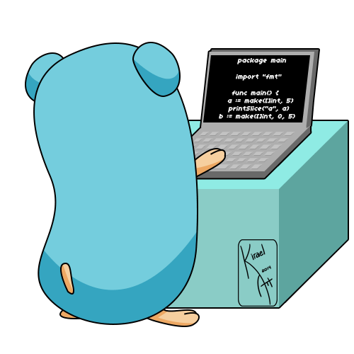

# SynAck (Port Scanner)

## Core team:
*danabolik and FalloutBaby*

## Usage
`go run ./cmd/main.go {domain/ip_address} {count gorutines}`
>You may request certain address and amount of concurrent requests.
By default, they are `scanme.nmap.org` and `8`

